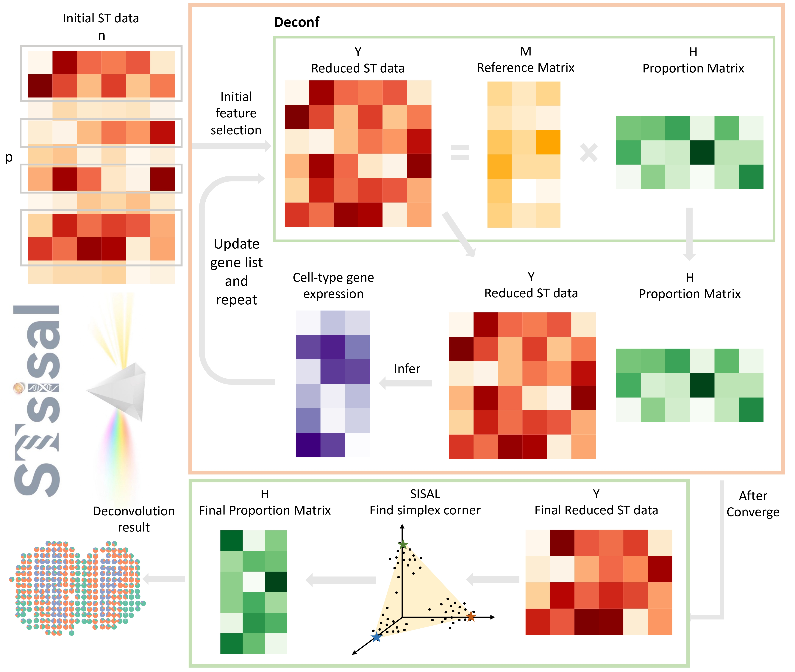
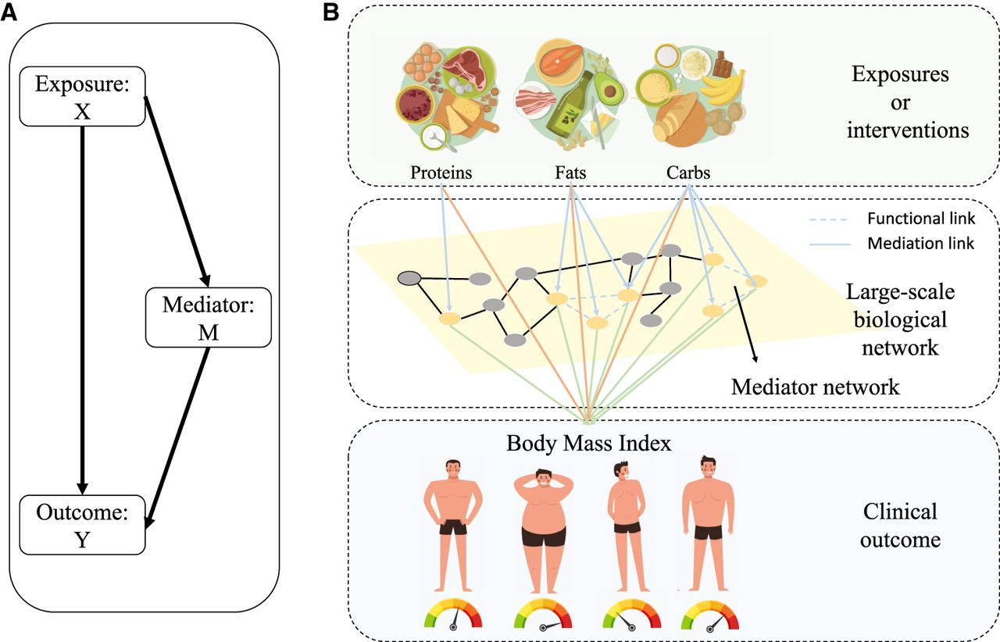
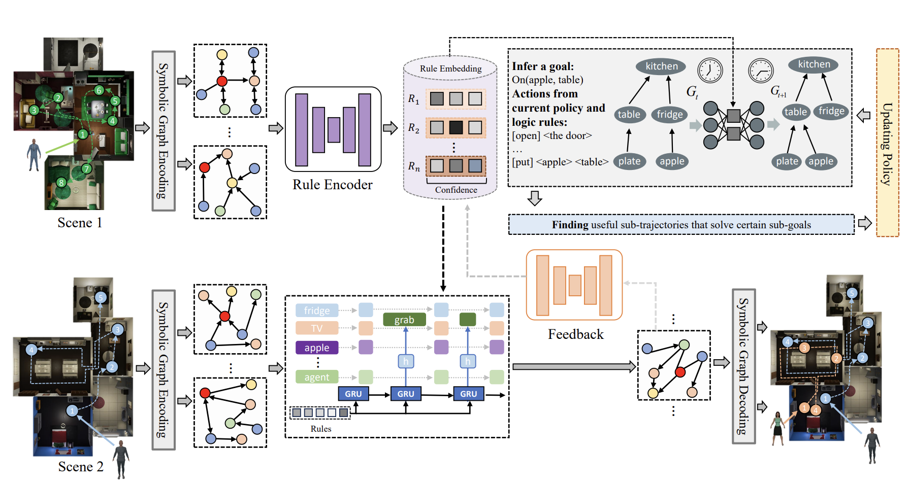
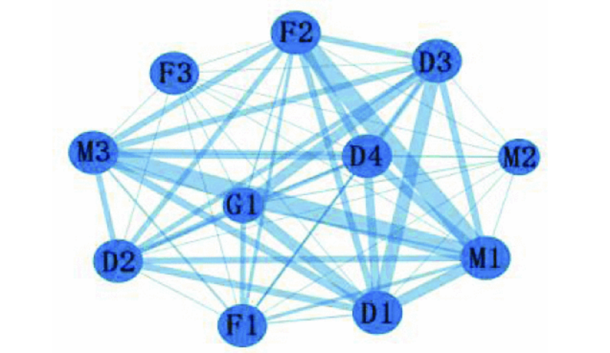








# Welcome! 
I am Yinghao FU, currently a first-year Ph.D. student in Biostatistics at the City University of Hong Kong (CityU), where I am mentored by Professor [Yi Yang](https://yiyangphd.github.io/). Prior to this, I obtained my Master's degree from The Chinese University of Hong Kong, Shenzhen (CUHK-Shenzhen), where I am advised by Professor [Tianwei Yu](https://mypage.cuhk.edu.cn/academics/yutianwei/) and [Shuang Li](https://shuangli01.github.io/).

My research focuses on developing data-driven and theory-driven methods to address challenges in genomics data analysis, with applications in healthcare.

You can find my CV here: [Yinghao Fu's Curriculum Vitae](../assets/Curriculum_Vitae.pdf). If you are interested in my work, please feel free to drop me an [email](mailto:yinghao.fu@my.cityu.edu.hk).

# 🔥 News
- *2025.03*: One paper accepted at Frontiers in Genetics.
- *2024.07*: Presented a talk at the EcoStat conference in Beijing.
- *2024.05*: One paper accepted at ICML 2024.
- *2024.04*: One paper accepted at Genome Research.
- *2024.01*: Presented a talk at the PMOSHK in Hong Kong.

# 📝 Publications 
 \* represents equal contribution

### Journal

Frontiers in Genetics

### **Frontiers in Genetics**
- [STsisal: a reference-free deconvolution pipeline for spatial transcriptomics data](https://www.frontiersin.org/journals/genetics/articles/10.3389/fgene.2025.1512435/full)  
**Yinghao Fu**, Leqi Tian, Weiwei Zhang

Genome Research

### **Genome Research**
- [A new framework for exploratory network mediator analysis in omics data](https://genome.cshlp.org/content/34/4/642)  
  *Qingpo Cai\*, **Yinghao Fu\***, Cheng Lyu\*, Zihe Wang, Shun Rao, Jessica A Alvarez, Yun Bai, Jian Kang, Tianwei Yu*  

### Conference

ICLR

- [Enhancing Human-AI Collaboration Through Logic-Guided Reasoning](https://openreview.net/forum?id=TWC4gLoAxY)  
  *Chengzhi Cao\*, **Yinghao Fu\***, Sheng Xv, Ruimao Zhang, Shuang Li*
  **ICLR 2024**

ICML

- [Neuro-Symbolic Temporal Point Processes](https://proceedings.mlr.press/v235/yang24ag.html)  
  *Yang Yang, Chao Yang, Boyang Li, **Yinghao Fu**, Shuang Li*  
  **ICML 2024**

CCC

- [The Team Winning Analysis Model Based on Network and Entropy Weight](https://ieeexplore.ieee.org/abstract/document/9550602/)  
  *Weihao Xia, **Yinghao Fu**, Jingliang Shi, Honghua Wu, Jihui Wang*  
  **40th Chinese Control Conference (CCC)**

# 📖 Educations
- *2024.09 - Present*, PhD in Biostatistics, City University of Hong Kong
  - Supervised by [Yi Yang](https://yiyangphd.github.io/)
- *2022.09 - 2024.07*, Master of Science in Bioinformatics, The Chinese University of Hong Kong (Shenzhen)
  - Supervised by [Prof. Tianwei Yu](https://mypage.cuhk.edu.cn/academics/yutianwei/) and [Prof. Shuang Li](https://shuangli01.github.io/)
- *2018.09 - 2022.07*, Bachelor of Science in Statistics, East China University of Technology
  - Supervised by Prof. Weiwei Zhang

# 💬 Invited Talks
- *2024.07*, [**Integrating Logic Rule-Informed AI with Human Minds: Enhancing Collaborative Decision-Making**](https://www.cmstatistics.org/RegistrationsV2/EcoSta2024/viewSubmission.php?in=324&token=3ss624p42s53sro50711q8pp29o6247q)  
  - Beijing, China, July 2024. 
- *2024.01*, [**Discovering Logic-Informed Intrinsic Rewards to Explain Human Policies**](https://pomshk2024.hkust.edu.hk/conference-programme)
  - Hong Kong SAR, China, January 2024

# 💻 Services
- Reviewer: NeurIPS, ICML, ICLR, AISTATS, ICML Workshop MAS

# 📝 Teaching
- BIOS 5802: Advanced Methods in Biostatistics (Spring 2025)
